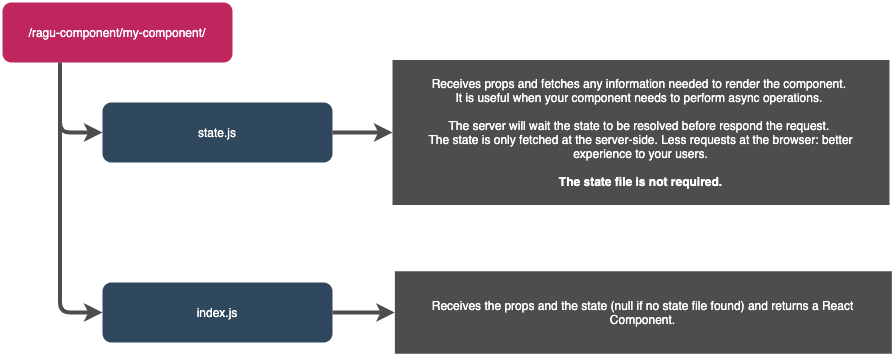

<p align="center" style="color: #343a40">
  <p align="center" >
    
  </p>
  <h1 align="center">Ragu React Server Adapter</h1>
</p>


[](https://coveralls.io/github/ragu-framework/ragu-react-server-adapter?branch=main)


A React adapter for [Ragu Server - A micro-frontend framework](https://ragu-framework.github.io).

## Installation

```shell script
npm install ragu-server
npm install ragu-react-server-adapter
```

## Configuration

### The config file
Create a `ragu-config.js` file with as bellow:

```javascript
const {createReactRaguServerConfig} = require('ragu-react-server-adapter/config');

module.exports = createReactRaguServerConfig({
    compiler: {
        assetsPrefix: 'http://localhost:3100/component-assets/'
    },
    components: {
        namePrefix: 'my_project_name_'
    }
});
```

You must provide theses two properties:

`compiler.assetsPrefix` micro-frontends could be loaded at any domain. So you must define which domain it will fetch
assets.

`compiler.namePrefix` used to prevent micro-frontends name collision.

There are a set of optional properties which you can override. All configurations described [here](https://ragu-framework.github.io/ragu/modules/_src_config_.html#raguserverbaseconfigprops).

### NPM Commands

Adding ragu commands to `npm` scripts section into `package.json`:

```json
{
  "scripts": {
    "ragu:build": "ragu-server build ragu-config.js",
    "ragu:start": "ragu-server run ragu-config.js",
    "ragu:dev": "ragu-server dev ragu-config.js"
  }
}
```

## Exposing a React component



You must create a `ragu-components` directory at the project root. You can override the `ragu-components` overriding
the `config.components.sourceRoot` config.

Ragu uses a file-system based route system as same as `NextJs`. If you are not familiar with the concept, here an example:

A component created at:

- `/ragu-components/hello-world/index.js`

Will be available at the ragu server at:

- **Component route:** `http://you-ragu-server-host/components/ragu-components/hello-world/`
- **Preview route:** `http://you-ragu-server-host/components/ragu-components/hello-world/`

So, to expose a component you need to create a `ragu-components/{you-component-name}/index.js` (`.jsx` | `ts` | `tsx`)
exposing a default function which will receive the `props` and `state` if needed.

```jsx
export default (props, state) => <MyConponent props={props} state={state} />
```

## Fetching the state

The `ragu-components/{you-component-name}/state.js` file receives the `props` and maps it to `state`.

```js
export default (props) => {
  return fetch('https://pokeapi.co/api/v2/pokemon/' + props.id)
    .then((response) => response.json());
}
```

In the example bellow, we receive an id form props and fetch a Pokémon from pokéapi.
`Props` are passed to components through query parameters:

`http://you-ragu-server-host/components/ragu-components/pokemon/?id=1`

## Webpack configuration

This repository delivers a basic `webpack` configuration for React that is compatible with projects created with
`create-react-app`. If you need some extra configuration you can:

1. Extending the configuration
2. Create your own Webpack Configuration

### Extending the webpack configuration

You can extend your configuration using `webpack-merge`.

```shell script
npm install webpack-merge
```

```javascript
const {createReactRaguServerConfig} = require('ragu-react-server-adapter/config');
const {merge} = require('webpack-merge');


const config = createReactRaguServerConfig({
    compiler: {
        assetsPrefix: 'http://localhost:3100/component-assets/'
    },
    components: {
        namePrefix: 'my_project_name_'
    }
});

config.compiler.webpack.view = merge(config.compiler.webpack.view, {
  // Your extra configuration goes here
});

config.compiler.webpack.hydrate = merge(config.compiler.webpack.hydrate, {
  // Your extra configuration goes here
});

module.exports = config
```

### Create your own Webpack Configuration

If you really need a custom webpack configuration, instead of using the `webpack-merge`
to extend the default configuration you can just put the webpack
configuration at the `config.webpack.view` and `config.webpack.hydrate` fields.

The `view` configuration (aka server configuration) requires a `node` and `commonjs2` target.
We also recommend you to use `nodeExternals` to avoid adding `node_modules` packages to the `view` bundle.

```javascript
{
  "target": "node",

  "devtool": "source-map",

  "output": {
    "libraryTarget": "commonjs2",
    "filename": "[name].js",
  },

  "externals": nodeExternals(),
}
```
