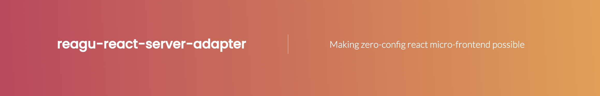

<p align="center" style="color: #343a40">
  <p align="center" >
    
  </p>
  <h1 align="center">Ragu React Server Adapter</h1>
</p>


[](https://coveralls.io/github/ragu-framework/ragu-react-server-adapter?branch=main)


A React adapter for [Ragu Server - A micro-frontend framework](https://ragu-framework.github.io).

## Installation

```shell script
yarn install ragu-cli
yarn install ragu-react-server-adapter
```

## Exposing a Component

Create a file that exposes a single function that returns your component:

```jsx
# my-mfe.jsx
export default () => <MyReactComponent />
```

After, start the ragu server using the cli:

```shell script
yarn ragu-cli dev --file my-mfe.jsx
```

Open your browser at http://localhost:3100/preview to check your micro-frontend live!

That's all!


## Build to production

```shell script
yarn ragu-cli static --file my-mfe.jsx --baseurl https://mycdnhost/mymfe --output production
```

It will create a directory called `production` with a file called `index.json`.

### Using your component

```jsx
import {RaguComponent} from "ragu-client-react";


<RaguComponent src="https://mycdnhost/mymfe/index.json" />
```

Check The docs for More: https://ragu-framework.github.io/#!/ragu-react-server-adapter
